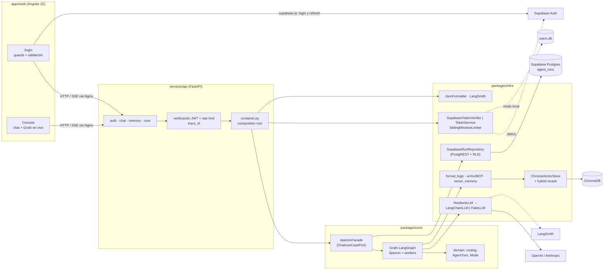
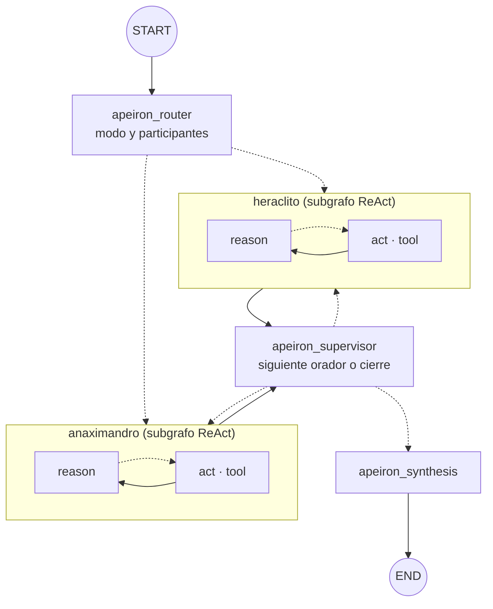

# Ápeiron Ecosystem

Plataforma multiagente de razonamiento filosófico-científico. **Ápeiron**, el orquestador, enruta cada pregunta, supervisa los turnos y sintetiza. Los workers **Anaximandro** y **Heráclito** razonan con un ciclo ReAct, usan herramientas (lógica formal, arXiv/MCP, memoria vectorial) y, en modo debate, se responden entre sí.

El backend es un monorepo modular con arquitectura hexagonal y un único servicio API desplegable. El frontend es Angular 22. La orquestación es LangGraph, la observabilidad usa logs JSON y LangSmith, y el despliegue se hace con Docker Compose y CI/CD en GitHub Actions hacia EC2. Cada decisión está documentada en un [ADR](docs/adr/).

## Índice

1. [Guía rápida E2E](#guía-rápida-e2e)
2. [Arquitectura](#arquitectura)
3. [Orquestación multiagente](#orquestación-multiagente)
4. [API y contrato SSE](#api-y-contrato-sse)
5. [Autenticación y sesiones](#autenticación-y-sesiones)
6. [Persistencia](#persistencia)
7. [Resiliencia](#resiliencia)
8. [Observabilidad y monitoreo](#observabilidad-y-monitoreo)
9. [Frontend](#frontend)
10. [Configuración](#configuración)
11. [Calidad y tests](#calidad-y-tests)
12. [Despliegue y CI/CD](#despliegue-y-cicd)
13. [Estructura del monorepo](#estructura-del-monorepo)
14. [ADRs](#adrs)

---

## Guía rápida E2E

**Requisitos:** Docker y Docker Compose v2. Para desarrollar fuera de Docker: Python ≥ 3.12 y Node `^22.22.3` o `^24`.

### 1. Configurar

```sh
cp .env.example .env
```

Para empezar sin coste deja `APEIRON_LLM_PROVIDER=fake`. Para usar un modelo real, define el proveedor, el modelo y su clave:

```env
APEIRON_LLM_PROVIDER=openai
APEIRON_LLM_MODEL=gpt-5.6-luna
OPENAI_API_KEY=sk-...
APEIRON_LLM_REASONING_EFFORT=low          # menos tokens de razonamiento
APEIRON_LANGSMITH_ENABLED=true            # opcional: trazas en LangSmith
APEIRON_LANGSMITH_API_KEY=lsv2_...
```

**Sesiones y historial con Supabase** (recomendado; ver [ADR-010](docs/adr/0010-supabase-sessions-runs.md)):

1. En el [dashboard de Supabase](https://supabase.com/dashboard), copia de tu proyecto la **Project URL** y la **publishable key** (*Project Settings → API Keys*; vale también la `anon` legacy). No uses la `secret`/`service_role`: no hace falta.
2. Pégalas en `.env`:
   ```env
   APEIRON_AUTH_PROVIDER=supabase
   APEIRON_SUPABASE_URL=https://<project-ref>.supabase.co
   APEIRON_SUPABASE_PUBLISHABLE_KEY=sb_publishable_...
   ```
3. Aplica el esquema con **migraciones** de la Supabase CLI (nunca SQL a mano): `npx supabase link --project-ref <ref>` y `npx supabase db push`. Crea `agent_runs`, `agents`, `agent_executions` y la RPC `record_agent_run`, todo con RLS. Detalle en [supabase/README.md](supabase/README.md).
4. En *Authentication → URL Configuration*, pon `http://localhost` como **Site URL**. Para entrar sin confirmar el correo durante el desarrollo, desactiva *Confirm email* en *Authentication → Sign In / Providers → Email*.

Con `APEIRON_AUTH_PROVIDER=local` la app funciona sin Supabase (SQLite y JWT en memoria), pero sin sesión persistente ni historial. Si eliges `supabase` y dejas vacías la URL o la clave, la API no arranca y te dice qué falta.

### 2. Levantar el stack

```sh
docker compose -f deploy/docker-compose.yml --profile web up --build
```

| Servicio | Puerto | Función |
|---|---|---|
| `web` | `80` (público) | Nginx: sirve Angular y reenvía `/api` a la API, con SSE sin buffering |
| `api` | `127.0.0.1:8000` | FastAPI y LangGraph |
| `chroma` | interno | Memoria vectorial (volumen `chroma-data`) |
| `studio` | `127.0.0.1:2024` | Opcional (perfil `studio`): servidor de LangGraph Studio |

La primera vez que arranca, la API descarga el modelo de embeddings de Chroma (~80 MB).

### 3. Usar la aplicación

Abre **http://localhost**:

1. Te redirige a **`/login`**. Elige **Crear cuenta** o **Entrar**: con Supabase se usa correo (si el proyecto exige confirmación, primero abre el enlace del email); en modo local, un usuario de 3 a 64 caracteres. La contraseña debe tener entre 8 y 72 caracteres. Con Supabase la sesión **se mantiene al recargar** y se renueva sola.
2. Elige un caso de estudio o escribe una pregunta, y el modo:
   - **Consulta**: Ápeiron elige un worker según la intención (por defecto Anaximandro; Heráclito si mencionas *devenir* o *logos*).
   - **Debate**: Anaximandro y Heráclito hablan por turnos (1 o 2 rondas) y Ápeiron cierra con una síntesis.
3. **Simulación · 0 tokens** viene activada. Recorre el grafo completo con un LLM determinista que **no razona**: compone sus respuestas con la evidencia real recuperada de la memoria y la posición del interlocutor (marcadas `[simulación]`). Sirve para validar la mecánica sin coste. **Desactívala para ver razonamiento real** del modelo.
   - Cada turno muestra a quién responde (con la cita), su texto y el **razonamiento observable**: herramienta, consulta y observación. Las consultas forzadas por la política de evidencia aparecen como *consulta automática*.
4. El panel **Grafo en vivo** ilumina cada nodo mientras se ejecuta y muestra las llamadas LLM, los tokens y el tiempo de la ejecución.
5. Con Supabase, la pestaña **Historial** del panel izquierdo lista tus ejecuciones guardadas. Haz clic en una para reabrir sus turnos, la síntesis, la traza y el consumo.

Coste de referencia con `gpt-5.6-luna` y `reasoning_effort=low`: una consulta simple ≈ 360 tokens (1 llamada); un debate de 1 ronda ≈ 2.300 tokens (3 llamadas) sin evidencia obligatoria y ≈ 6.500 tokens (6–7 llamadas) con `APEIRON_REQUIRE_EVIDENCE=true`.

### 4. Ver el grafo en LangGraph Studio

```sh
docker compose -f deploy/docker-compose.yml --profile studio up --build studio
```

Abre **https://smith.langchain.com/studio/?baseUrl=http://127.0.0.1:2024** en Chrome o Edge. El servidor `langgraph dev` corre en tu Docker; la interfaz de Studio es la web de LangSmith y se conecta a él desde tu navegador. No existe una versión de la interfaz que se ejecute en local.

- **`apeiron_demo`**: LLM simulado, 0 tokens. Recomendado para explorar.
- **`apeiron`**: el LLM configurado en `.env`.

Entrada de ejemplo: `{"question": "Debate: ¿todo fluye?", "mode": "debate", "max_rounds": 1}`. Con la vista de subgrafos activada se ve `reason ⇄ act` dentro de cada worker. En Studio no hay JWT: la memoria se consulta como usuario `anonymous`.

### 5. Verificar de punta a punta por terminal

```sh
# Modo supabase: usa un usuario ya registrado y confirmado
docker compose -f deploy/docker-compose.yml exec -T -e SMOKE_EMAIL=tu@correo.com -e SMOKE_PASSWORD='...' \
  api python - < deploy/scripts/smoke_e2e.py

# Modo local: crea un usuario aleatorio
docker compose -f deploy/docker-compose.yml exec -T api python - < deploy/scripts/smoke_e2e.py
```

[`smoke_e2e.py`](deploy/scripts/smoke_e2e.py) detecta el proveedor con `/v1/auth/config`, entra por Nginx igual que el navegador y comprueba lo siguiente:

- **Autenticación:** healthz, petición sin token (401), login (Supabase Auth o registro/login local), contraseña incorrecta, token alterado (401) y token aceptado.
- **Chat:** chat SSE con el LLM configurado y respuesta no vacía.
- **Chroma:** la memoria del usuario queda persistida.
- **Historial (Supabase):** la ejecución aparece en `/v1/runs` y su detalle coincide con la respuesta.
- **LangSmith:** la traza aparece en el proyecto, si LangSmith está activado.

Con modelo real cuesta unos 360 tokens.

---

## Arquitectura

```text
apps/web ──HTTP/SSE──▶ deploy/nginx ──▶ services/api ──▶ packages/infra ──▶ packages/core
 Angular 22              /api proxy       FastAPI           adaptadores        dominio +
                                          composition root  de salida          aplicación
```

Las dependencias apuntan hacia el núcleo: `services/api → packages/infra → packages/core`, y dentro de `core`, `application → domain`. `import-linter` verifica en CI cuatro contratos:

| Contrato | Garantía |
|---|---|
| Capas `api → infra → core` | Nunca al revés |
| Núcleo sin proveedores | `core` no importa FastAPI, httpx, JWT, bcrypt, Chroma, LangChain, MCP ni tenacity |
| Dominio puro | `domain` no importa LangGraph, `application` ni adaptadores |
| Aplicación sin adaptadores | `application` no importa `infra` ni `api` |

LangGraph es la única dependencia de terceros que se permite en `application` (orquestación). Los modelos de lenguaje se usan a través del puerto `LLMPort`; las herramientas, a través de `ToolPort`; la memoria, a través de `VectorStorePort`. [`container.py`](services/api/src/apeiron_api/container.py) es el composition root: es el único lugar que conoce las implementaciones concretas.



---

## Orquestación multiagente

Topología supervisor/worker ([ADR-009](docs/adr/0009-supervisor-worker-studio.md)), implementada en [`graph.py`](packages/core/src/apeiron_core/application/orchestration/graph.py):



| Nodo | Responsabilidad |
|---|---|
| `apeiron_router` | Decide el modo (`single`/`debate`, explícito o por heurística de dominio) y los participantes |
| `<worker>` | Un nodo por agente registrado; ejecuta su subgrafo ReAct y publica un `AgentTurn` |
| `apeiron_supervisor` | Tras cada turno elige el siguiente worker o cierra al alcanzar `max_rounds` |
| `apeiron_synthesis` | En debate, síntesis LLM de acuerdos y desacuerdos; en `single` devuelve el turno sin llamar al LLM |

**Workers ReAct.** [`ReActAgent`](packages/core/src/apeiron_core/application/agents/react.py) compila su propio subgrafo: `reason` llama al LLM con el protocolo `Thought → Action → Observation → Reflect → Final Answer`, y `act` ejecuta la herramienta. El ciclo se repite hasta obtener una respuesta final o agotar `APEIRON_MAX_REACT_STEPS`. El razonamiento privado nunca se devuelve como respuesta, y una herramienta desconocida devuelve un error controlado en lugar de ejecutarse.

| Worker | Rol | Herramientas |
|---|---|---|
| Anaximandro | Tesis desde el ápeiron, lógica formal y evidencia | `formal_logic_calculator`, `mcp_public_api_tool`, `vector_memory_retriever` |
| Heráclito | Contrapunto dialéctico desde el devenir y el logos | `vector_memory_retriever`, `mcp_public_api_tool` |

**Interacción.** En debate, los workers hablan por turnos. Cada prompt incluye solo la **última posición** de cada interlocutor, con la instrucción de reconocer un acuerdo y formular su objeción. Así Heráclito replica a Anaximandro dentro de la misma ronda, y el contexto no crece con el historial completo.

**Herramientas** ([`packages/infra/.../tools`](packages/infra/src/apeiron_infra/tools/)):

- `formal_logic_calculator`: parser propio, sin `eval`, con tabla de verdad de hasta 8 variables; verifica la validez de argumentos.
- `mcp_public_api_tool`: usa un servidor MCP si está definido `APEIRON_MCP_SERVER_URL`; si no, busca en arXiv por HTTP, protegido con circuit breaker.
- `vector_memory_retriever`: busca en la memoria del usuario y en el conocimiento global sembrado.

**Extensibilidad.** Un agente nuevo (por ejemplo, Sócrates) es una fábrica más en el `AgentRegistry`. El grafo genera su nodo automáticamente y no hay que tocar el supervisor. Los participantes del debate se configuran explícitamente (`debate_participants`, de 1 a 4).

**Cotas duras:** rondas 1–4, participantes 1–4, pasos ReAct 1–8, timeout por nodo ≤ 300 s, timeout por herramienta ≤ 120 s y `recursion_limit` 100. Se validan en `Settings`, en el API y en el grafo.

---

## API y contrato SSE

| Método | Ruta | Descripción | Auth |
|---|---|---|---|
| `GET` | `/healthz` | Healthcheck (lo usan Docker y el deploy) | Pública |
| `GET` | `/v1/auth/config` | `{provider, public_register, runs_enabled}` y, con Supabase, `{supabase_url, supabase_key}` (publishable) | Pública |
| `POST` | `/v1/auth/register` | Solo modo local: alta `{username, password}` → 201, o 409 si ya existe, o 403 si el registro está cerrado | Pública |
| `POST` | `/v1/auth/token` | Solo modo local: OAuth2 password (form) → `{access_token, token_type}` | Pública |
| `GET` | `/v1/agents` | Topología: orquestador, workers (rol y tools), participantes, modelo y límites | Bearer |
| `POST` | `/v1/chat` | Respuesta completa: `{answer, mode, turns, trace, usage}` | Bearer |
| `POST` | `/v1/chat/stream` | Streaming `text/event-stream` | Bearer |
| `DELETE` | `/v1/memory` | Borra la memoria del usuario autenticado | Bearer |
| `GET` | `/v1/runs?limit=20` | Historial del usuario (resumen); 404 si no hay Supabase | Bearer |
| `GET` | `/v1/runs/{uuid}` | Ejecución completa: turnos, traza, síntesis, uso, modelo, duración | Bearer |

Cuerpo de chat: `{"question": "...", "mode": "single"|"debate", "max_rounds": 1-4, "simulate": false}`. Los campos `mode` y `max_rounds` son opcionales. `question` admite hasta 4000 caracteres.

Eventos SSE de `/v1/chat/stream`:

| Evento | Datos | Uso |
|---|---|---|
| `node` | `{node: "anaximandro/act", status: "start"\|"end", error}` | Iluminar el grafo; los nodos internos llevan ruta |
| `trace` | `{messages: ["[Ápeiron Delegating → heraclito r0]", ...]}` | Traza legible de transiciones y herramientas |
| `step` | `{agent, round, step, tool, input, observation, error, auto}` | Evidencia de cada paso ReAct con herramienta (el `Thought` no se expone) |
| `turn` | `{agent, round, text, degraded, responds_to}` | Intervención de un worker y a quién responde |
| `answer` | `{answer, mode, simulate, usage: {calls, input_tokens, output_tokens, total_tokens}}` | Cierre de la ejecución |
| `error` | `{message: "internal_error", trace_id}` | Fallo no recuperable; no expone detalles internos |

Cada respuesta HTTP incluye la cabecera `X-Trace-Id`. Si el cliente envía `x-trace-id`, se respeta.

---

## Autenticación y sesiones

Hay dos proveedores, seleccionados con `APEIRON_AUTH_PROVIDER` ([ADR-010](docs/adr/0010-supabase-sessions-runs.md)):

| | `supabase` (recomendado) | `local` |
|---|---|---|
| Identidad | Supabase Auth (correo y contraseña) | SQLite (`users.db`) con bcrypt |
| Emisión del token | Supabase (`/auth/v1/token`), desde el navegador | `POST /v1/auth/token` de la API |
| Sesión en el navegador | **Persistente** (supabase-js): sobrevive a recargas, renovación automática y sincronización entre pestañas | Solo en memoria: recargar obliga a entrar de nuevo |
| Verificación en la API | JWKS del proyecto (ES256/RS256, caché de 1 h) o `APEIRON_SUPABASE_JWT_SECRET` (HS256 legacy); exige `aud=authenticated` e `iss` del proyecto | HS256 con `APEIRON_JWT_SECRET`; rotación con `APEIRON_JWT_SECRET_PREVIOUS` |
| `user_id` | UUID (`sub` de Supabase) | Nombre de usuario |
| Historial de ejecuciones | Sí (`agent_runs` con RLS) | No |

Comunes a ambos modos:

- **Identidad:** el `user_id` sale siempre del token verificado, nunca de un campo que envíe el cliente. Se propaga por `ContextVar` a los logs, a las trazas y al ámbito de la memoria. Con Supabase, el token del usuario viaja en el contexto como credencial delegada para que Postgres aplique RLS; no aparece en logs ni en `repr`.
- **Secretos:** la publishable key de Supabase es pública por diseño (la API se la entrega al navegador). La API **no** necesita la `service_role` key. En producción (`APEIRON_ENV=prod`) el modo local no arranca con el secreto de desarrollo, y ningún error de configuración vuelca valores de entrada al log.
- **Registro:** con Supabase se controla en el dashboard (registro y confirmación de correo). En modo local, `APEIRON_PUBLIC_REGISTER=false` lo cierra (403). La UI oculta *Crear cuenta* si `public_register` es `false`.
- **Rate limiting:** Supabase limita los intentos de login. La API limita el chat por usuario (`APEIRON_CHAT_RATE_LIMIT_PER_MIN`) y, en modo local, el auth por IP (`APEIRON_AUTH_RATE_LIMIT_PER_MIN`), con ventana deslizante de 60 s y respuesta 429. El limitador de la API es en memoria: aplica por instancia y se reinicia con la API.

**En el navegador:**

- Las rutas están protegidas con guards.
- Antes del primer render, un *app initializer* consulta `/v1/auth/config` y restaura la sesión persistida.
- Un interceptor añade el Bearer a las llamadas a la API. Ante un 401, cierra la sesión (también la de Supabase) y vuelve a `/login` con el aviso *"Tu sesión expiró"*.
- Los errores de Supabase se traducen a mensajes accionables: credenciales incorrectas, correo sin confirmar, cuenta existente, contraseña débil y demasiados intentos.

---

## Persistencia

| Dato | Almacén | Volumen | Detalle |
|---|---|---|---|
| Usuarios y sesiones | **Supabase Auth** | Gestionado por Supabase | Modo `supabase`. La sesión del navegador la persiste supabase-js. |
| Ejecuciones de agentes | **Supabase Postgres**, `public.agent_runs` | Gestionado por Supabase | Pregunta, modo, simulación, turnos, traza, **evidencia (`steps`)**, síntesis, uso, modelo, duración, `trace_id` y estado (`completed`/`error`). RLS por `auth.uid()`; inmutables (sin UPDATE). Las simulaciones también se guardan, marcadas como tales. |
| Identidad de agentes | `public.agents` | Gestionado por Supabase | Catálogo `apeiron` (orquestador), `anaximandro` y `heraclito` (workers): rol y herramientas. Solo cambia por migración. |
| Agentes ejecutados | `public.agent_executions` | Gestionado por Supabase | Una fila por agente y ejecución: invocaciones, pasos de razonamiento, llamadas a herramientas, herramientas usadas, degradación y duración. Se escribe junto con la ejecución en una transacción (RPC `record_agent_run`). |
| Usuarios (modo local) | SQLite (`SqliteUserRepository`) | `api-data` → `/app/data/users.db` | Solo con `APEIRON_AUTH_PROVIDER=local`. Sin `APEIRON_USERS_DB_PATH` se usa un repositorio en memoria. |
| Memoria de usuario | ChromaDB, colección `apeiron_memory` | `chroma-data` → `/data` | Tras cada ejecución real se guarda `Q: … / A: …` con `user_id`. **La simulación no escribe memoria.** |
| Conocimiento global | ChromaDB (`user_id=global`) | `chroma-data` | Fragmentos presocráticos y de física sembrados al arrancar. Usa *upsert* idempotente, así que no se duplican. |
| Trazas | LangSmith (cloud) | — | Opcional; ver la sección [Observabilidad](#observabilidad-y-monitoreo). |

**Recuperación híbrida:** se combinan candidatos semánticos (embeddings de Chroma) y léxicos (BM25) con pesos configurables (`APEIRON_MEMORY_SEMANTIC_WEIGHT` 0.6 / `APEIRON_MEMORY_LEXICAL_WEIGHT` 0.4, que deben sumar 1). Cada fragmento se etiqueta con su fuente (`[source=global]` o `[source=user]`). Las búsquedas filtran por `user_id ∈ {usuario, global}`, de modo que un usuario nunca ve la memoria de otro.

**Retención y borrado:**

- Se conservan como máximo `APEIRON_MEMORY_MAX_DOCS_PER_USER` documentos por usuario (200); los más antiguos se eliminan.
- `DELETE /v1/memory` borra toda la memoria del usuario autenticado.
- El LangGraph no guarda memoria conversacional implícita entre invocaciones.

**Ejecuciones:** la facade registra cada ejecución al terminar, también las que fallan. Si Supabase no responde, se registra un warning (`run_persist_failed`) y el chat continúa. Se consultan con `GET /v1/runs` o en la pestaña *Historial*; para borrarlas se usa la política `delete` de RLS (por ejemplo, desde el dashboard).

Los volúmenes `api-data` y `chroma-data` sobreviven a `docker compose down` y a la recreación de contenedores. Respáldalos antes de cada actualización en producción ([DEPLOY.md](docs/DEPLOY.md)); los datos de Supabase tienen sus propios backups gestionados.

---

## Resiliencia

| Mecanismo | Dónde | Configuración |
|---|---|---|
| Timeout por intento LLM | `call_with_retry` | `APEIRON_LLM_TIMEOUT_S` |
| Reintentos con backoff exponencial y jitter | `call_with_retry` (tenacity) | `APEIRON_LLM_RETRIES` (máx. 8 s entre intentos) |
| Circuit breaker `closed → open → half_open` | `CircuitBreaker`; en `half_open` deja pasar una sola prueba a la vez | `APEIRON_BREAKER_FAILURES`, `APEIRON_BREAKER_RECOVERY_S` |
| Modelo de respaldo | `ResilientLLM` cambia al fallback si falla el principal | `APEIRON_LLM_FALLBACK_MODEL` |
| Timeout por worker y por síntesis | Nodos del grafo | `APEIRON_NODE_TIMEOUT_S` |
| Timeout por herramienta | `ReActAgent._run_tool` | `APEIRON_TOOL_TIMEOUT_S` |
| Breaker para arXiv/MCP | `McpPublicApiTool` | Valores por defecto |

**Degradación controlada:**

- Si un worker falla o excede su tiempo, su turno queda marcado `degraded: true` y el debate continúa.
- Si falla la síntesis, se devuelve una síntesis determinista con los turnos completados, sin inventar evidencia.
- Si ningún worker completó su turno, se informa explícitamente.
- Si falla el guardado de memoria, solo se registra un warning y la respuesta llega igualmente.
- En el stream, un error no recuperable emite `error` con su `trace_id` y nunca expone la traza interna.

**Contenedores:** la API tiene `HEALTHCHECK` (`/healthz`) y todos los servicios usan `restart: unless-stopped`.

---

## Observabilidad y monitoreo

**Logs estructurados.** Cada línea de stdout es un JSON con estos campos:

- `ts`, `level`, `logger` y `message`.
- `trace_id` y `user_id`, inyectados desde el contexto de la petición.
- Campos extra según el evento.

Eventos principales:

| Evento | Campos clave |
|---|---|
| `llm_call` | `model`, `execution_time_ms`, `token_usage` |
| `route` | `state_transition` (`router->debate`) |
| `agent_turn` | `agent_name`, `state_transition`, `execution_time_ms` |
| `llm_primary_failed` | `error`, `breaker_state` |
| `agent_turn_failed`, `synthesis_failed`, `memorize_failed`, `stream_failed` | Fallos degradados |

```sh
docker compose -f deploy/docker-compose.yml logs -f api | grep llm_call     # consumo por llamada
docker compose -f deploy/docker-compose.yml logs api | grep '"level": "ERROR"'
```

**LangSmith.** Con `APEIRON_LANGSMITH_ENABLED=true` y una API key, cada ejecución aparece como `apeiron_chat` en el proyecto `APEIRON_LANGSMITH_PROJECT`. Cada traza incluye:

- El árbol completo: router, worker, subgrafo `reason`/`act`, llamadas LLM con prompt y respuesta, tokens y latencia.
- Metadatos `trace_id`, `user_id`, `session_id` y `simulate`.
- Etiquetas `apeiron` y `live` o `simulation`.

Para filtrar por usuario, búscalo por `metadata.user_id`. El `trace_id` de los logs y de la cabecera `X-Trace-Id` correlaciona una petición HTTP con su traza.

**Consumo por ejecución.** Un contador por petición (`ContextVar`) suma las llamadas y los tokens que reportan los adaptadores LLM. Se devuelve en `answer.usage` y la UI lo muestra.

**Grafo en vivo y Studio.** Los eventos `node` del SSE alimentan el panel *Grafo en vivo*. LangGraph Studio permite además inspeccionar el estado nodo a nodo ([sección 4 de la guía](#4-ver-el-grafo-en-langgraph-studio)).

---

## Frontend

Angular 22 standalone, con signals y carga lazy ([`apps/web`](apps/web/), detalle en su [README](apps/web/README.md)). Cada contexto (`auth`, `research`) se organiza en capas `domain → application → infrastructure / presentation`; `architecture.spec.ts` verifica en los tests que ninguna capa interna importe una externa.

| Pieza | Ubicación | Función |
|---|---|---|
| Proveedor de identidad | `auth/infrastructure/runtime-auth.gateway.ts` | Lee `/v1/auth/config` y elige `SupabaseAuthGateway` (supabase-js, chunk lazy) o `HttpAuthGateway` (local) |
| Sesión | `auth/application/session.store.ts`, `auth.service.ts` | Restaura la sesión al arrancar, sincroniza renovaciones y logout externo, y caduca el JWT local |
| Rutas, guards e interceptor | `app.routes.ts`, `auth/presentation/auth.guards.ts`, `auth/infrastructure/auth.interceptor.ts` | `/login` (solo invitados), `/` (solo autenticados), Bearer y manejo de 401 |
| Validación y errores | `auth/domain/credentials.ts`, `auth/infrastructure/*-errors.ts` | Correo o usuario según el proveedor; mensajes por status o código de Supabase |
| Streaming | `research/infrastructure/sse-chat-stream.adapter.ts` | SSE sobre `fetch` (POST con Authorization) con cancelación |
| Estado de ejecución | `research/application/run-state.ts`, `research.store.ts`, `research/domain/graph-run.ts` | Reducers puros: turnos, traza, grafo en vivo, uso y reapertura de ejecuciones guardadas |
| Historial | `research/infrastructure/http-run-history.repository.ts` | `GET /v1/runs` y `GET /v1/runs/{id}` |
| Pantallas | `auth/presentation/login/`, `research/presentation/workspace/`, `research/presentation/agent-graph/` | Login, consola (casos/historial, chat, simulación) y grafo SVG en vivo |

En desarrollo, con la API corriendo en `:8000`:

```sh
cd apps/web && npm ci && npm start -- --proxy-config proxy.conf.json   # http://localhost:4200
```

---

## Configuración

Todas las variables usan el prefijo `APEIRON_` (salvo las claves de proveedor). La referencia completa está en [`.env.example`](.env.example).

| Grupo | Variables |
|---|---|
| Entorno | `ENV` (`dev`/`prod`), `LOG_LEVEL`, `CORS_ORIGINS` |
| Identidad (Supabase) | `AUTH_PROVIDER` (`supabase`/`local`), `SUPABASE_URL`, `SUPABASE_PUBLISHABLE_KEY`, `SUPABASE_JWT_SECRET` (solo HS256 legacy), `PERSIST_RUNS` |
| Auth (modo local) | `JWT_SECRET`, `JWT_SECRET_PREVIOUS`, `JWT_TTL_MINUTES`, `PUBLIC_REGISTER`, `USERS_DB_PATH`, `AUTH_RATE_LIMIT_PER_MIN`, `CHAT_RATE_LIMIT_PER_MIN` |
| LLM | `LLM_PROVIDER` (`fake`/`openai`/`anthropic`), `LLM_MODEL`, `LLM_FALLBACK_MODEL`, `LLM_MAX_TOKENS`, `LLM_REASONING_EFFORT`, `OPENAI_API_KEY`, `ANTHROPIC_API_KEY` |
| Resiliencia | `LLM_TIMEOUT_S`, `LLM_RETRIES`, `BREAKER_FAILURES`, `BREAKER_RECOVERY_S`, `NODE_TIMEOUT_S`, `TOOL_TIMEOUT_S` |
| Agentes | `DEFAULT_ROUNDS`, `MAX_REACT_STEPS`, `REQUIRE_EVIDENCE` (cada worker consulta al menos una herramienta; ≈ +1 llamada por worker), `DEBATE_PARTICIPANTS`, `SIMULATION_PACE_S` |
| Memoria | `VECTOR_BACKEND` (`chroma`/`memory`), `CHROMA_HOST`, `CHROMA_PORT`, `MEMORY_MAX_DOCS_PER_USER`, `MEMORY_SEMANTIC_WEIGHT`, `MEMORY_LEXICAL_WEIGHT` |
| Integraciones | `MCP_SERVER_URL` |
| Observabilidad | `LANGSMITH_ENABLED`, `LANGSMITH_API_KEY`, `LANGSMITH_PROJECT` |

**Para ahorrar tokens:**

- Usa `LLM_REASONING_EFFORT=low`, `DEFAULT_ROUNDS=1` y `MAX_REACT_STEPS=2`.
- Prefiere el modo Consulta.
- Activa la simulación siempre que quieras ver la arquitectura sin respuestas reales.

`.env` está en `.gitignore`. En producción se crea a mano en el servidor y nunca se versiona. Si una variable queda vacía, no le pongas un comentario en la misma línea: `python-dotenv` lo leería como valor.

---

## Calidad y tests

```sh
make install   # dependencias editables + herramientas
make check     # Ruff, mypy estricto e import-linter (4 contratos)
make test      # pytest: 70 tests
cd apps/web && npm test                                   # node:test: 20 tests (incluye reglas de capas)
cd apps/web && npm run build -- --configuration production
```

Qué cubren los tests:

- **Backend:** routing de dominio, topología con subgrafos, orden de turnos y diálogo entre workers, ciclo ReAct (herramientas, herramienta desconocida, sin filtrar razonamiento), degradación de worker y de síntesis, eventos de nodo y uso de tokens, evals deterministas (lógica, citas, sin inventar evidencia), circuit breaker y retries, JWT y rotación, SQLite, Chroma con retención, contrato API y SSE, simulación con 0 tokens y límites de configuración.
- **Frontend:** parser SSE, sanitizer, store, reducer del grafo en vivo, mensajes de error de auth, validación y lectura del `exp` del JWT.

---

## Despliegue y CI/CD

- **CI** ([`ci.yml`](.github/workflows/ci.yml)), en cada PR y en cada push a `main`:
  - Ruff, mypy, import-linter y pytest en Python 3.12, 3.13 y 3.14.
  - `npm ci` y build de Angular.
  - Solo en `main`: publica las imágenes `apeiron-api` y `apeiron-web` en GHCR con un tag inmutable `SHA-run-attempt`.
- **CD** ([`deploy-ec2.yml`](.github/workflows/deploy-ec2.yml)), tras un CI exitoso en `main`:
  - El `.env` de producción **vive en la VM y se edita allí**: el primer despliegue lo crea desde `.env.example`, y después CD nunca lo sobrescribe. Antes de reiniciar servicios lo valida con la clase `Settings` de la imagen nueva; si es inválido, aborta sin tocar los contenedores en marcha ([DEPLOY.md](docs/DEPLOY.md#variables-de-entorno-env)).
  - Copia el Compose y [`deploy-ec2.sh`](deploy/scripts/deploy-ec2.sh), descarga las imágenes de ese tag, levanta el perfil `web` y verifica `/healthz`.
  - Configuración en GitHub: solo `AWS_SSH_PRIVATE_KEY` (secret) y `EC2_HOST` (variable).
- **Imágenes:**
  - API: multistage con Python 3.14 slim, usuario no-root, `WORKDIR /app` y healthcheck.
  - Web: Node 24 para el build y Nginx 1.27 para servir.
  - Chroma: fijado a `chromadb/chroma:1.5.9`.
- **Rollback:** se reejecuta el deploy con un tag anterior.

El servicio `studio` es solo para desarrollo y no forma parte del despliegue. La preparación de EC2, el TLS, los backups y la configuración de GitHub están en **[docs/DEPLOY.md](docs/DEPLOY.md)**.

---

## Estructura del monorepo

```text
packages/core/src/apeiron_core/
  domain/                  # AgentTurn, Mode, routing (decide_mode / decide_agent): Python puro
  application/
    agents/                # ReActAgent (subgrafo), fábricas, AgentRegistry, dialogue_block
    orchestration/         # ApeironState / ApeironInput y build_graph (supervisor/worker)
    ports/                 # inbound: ChatUseCasePort · outbound: LLMPort, ToolPort, VectorStorePort...
    use_cases/             # ApeironFacade: ask / stream (tasks + updates + custom, subgrafos)
    context.py, usage.py   # RequestContext (incl. credencial delegada) y contador de tokens
    dto/runs.py            # AgentRun; puerto outbound RunRepositoryPort
packages/infra/src/apeiron_infra/
  llm/                     # LangChainLLM, ResilientLLM, FakeLLM (simulación)
  memory/                  # ChromaVectorStore, InMemoryVectorStore, BM25 + rerank híbrido
  resilience/              # CircuitBreaker, call_with_retry
  security/                # TokenService, SupabaseTokenVerifier, repositorios de usuarios, SlidingWindowLimiter
  persistence/             # SupabaseRunRepository (agent_runs vía PostgREST con RLS)
  tools/                   # formal_logic, public_api (arXiv/MCP), vector_memory
  observability/           # JsonFormatter, configure_langsmith
services/api/src/apeiron_api/
  routes/                  # auth, chat, memory, runs
  container.py             # composition root: grafo real + grafo de simulación
  studio.py                # grafos para LangGraph Studio (apeiron, apeiron_demo)
  deps.py, schemas.py, settings.py, main.py
apps/web/src/app/
  auth/                    # domain · application (SessionStore, AuthService, puerto) · infrastructure
                           # (Runtime/Supabase/Http gateways, interceptor) · presentation (login, guards)
  research/                # domain (chat, graph-run, run-record) · application (store, reducers, puertos)
                           # infrastructure (SSE, topología, historial) · presentation (consola, grafo)
  shared/                  # configuración de API y utilidades de presentación
deploy/
  docker/                  # api, web y studio Dockerfiles
  docker-compose.yml       # api, chroma, web (perfil web), studio (perfil studio)
  nginx/                   # proxy /api con SSE sin buffering
  scripts/                 # deploy-ec2.sh, smoke_e2e.py
supabase/                  # config.toml + migrations/ (Supabase CLI): agent_runs, agents, agent_executions, RPC
langgraph.json             # configuración de LangGraph Studio
docs/adr/, docs/DEPLOY.md
```

---

## ADRs

| ADR | Decisión |
|---|---|
| [001](docs/adr/0001-modular-monorepo.md) | Monorepo modular y arquitectura limpia |
| [002](docs/adr/0002-python-runtime.md) | Runtime Python y stack |
| [003](docs/adr/0003-debate-topology.md) | Grafo único y agentes ReAct (la topología de debate fue reemplazada por el 009) |
| [004](docs/adr/0004-tools-memory-integrations.md) | Herramientas, MCP y memoria |
| [005](docs/adr/0005-security-resilience.md) | Seguridad y resiliencia |
| [006](docs/adr/0006-api-angular-streaming.md) | API, SSE y Angular |
| [007](docs/adr/0007-observability-quality.md) | Observabilidad y calidad |
| [008](docs/adr/0008-deployment-delivery.md) | Contenedores, despliegue y CI/CD |
| [009](docs/adr/0009-supervisor-worker-studio.md) | Supervisor/worker, workers como subgrafos y LangGraph Studio |
| [010](docs/adr/0010-supabase-sessions-runs.md) | Supabase: identidad, sesiones persistentes y ejecuciones de agentes |
