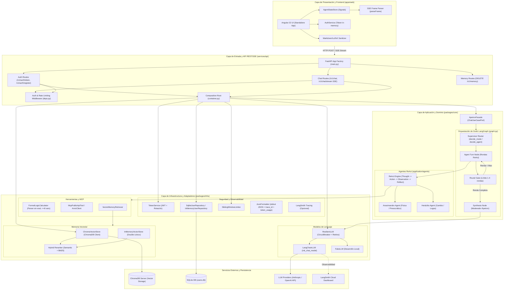

# Ápeiron Ecosystem

Plataforma multi-agente de razonamiento filosófico-científico. Ápeiron coordina a Anaximandro y Heráclito en consultas individuales o debates; los especialistas pueden usar herramientas de lógica, fuentes públicas, MCP y memoria.

El backend es un monorepo modular con un único servicio API desplegable. Los límites entre paquetes se verifican con `import-linter`. La arquitectura y sus decisiones están documentadas y formalmente **COMPLETADAS** en los [ADR](docs/adr/).

## Estado del Proyecto

- **Backend funcional:** Python, FastAPI, LangGraph, autenticación OAuth2/Bearer JWT, rate-limiting deslizante, REST y streaming SSE.
- **Agentes e interacción:** Anaximandro y Heráclito. Registro/fábricas para especialistas y moderador Ápeiron.
- **Adaptadores e Integraciones:**
  - **LLM / LangChain:** Adaptador provider-agnóstico (`LangChainLLM` con Anthropic, OpenAI o `FakeLLM` local).
  - **Memoria / ChromaDB:** Recuperación híbrida (embeddings semánticos + BM25 léxico con `hybrid_rerank`), política de retención por usuario y borrado operativo (`DELETE /v1/memory`).
  - **Seguridad y Persistencia:** Repositorio persistente de usuarios (`SqliteUserRepository`), almacenamiento de tokens solo en memoria en el cliente web y rotación de claves JWT (`APEIRON_JWT_SECRET_PREVIOUS`).
  - **Observabilidad / LangSmith:** Traza estructurada JSON en stdout con normalización de `token_usage` e integración opcional con LangSmith Tracing.
- **Web App (Angular 22):** Consola interactiva standalone con dashboard de casos, autenticación, streaming SSE en vivo, sanitización de Markdown/LaTeX y visor de trazas `Agent State Viewer`.
- **Todos los ADRs (0001 - 0008) están en estado COMPLETADO.**

---

## Arquitectura del Sistema

```text
apps/web --HTTP/SSE--> services/api
                            |  \
                            v   v
                         packages/core <-- packages/infra
                         domain + app    adaptadores de salida:
                                         LLM, MCP, memoria,
                                         seguridad y observabilidad

deploy/           Docker, Compose y Nginx
docs/             ADR y operación
```

La dependencia entre paquetes externos va hacia el núcleo: `services/api -> packages/infra -> packages/core`. Dentro de `core`, `application -> domain`; el dominio no importa aplicación, frameworks ni adaptadores. Los puertos de entrada/salida pertenecen a aplicación. `services/api` implementa el adaptador de entrada HTTP/SSE; `packages/infra` implementa puertos de salida. La API es el composition root que construye e inyecta adaptadores. `ApeironFacade` implementa el puerto de entrada de chat y `AgentFactory` configura cada especialista.

### Mapa Arquitectónico Completo (Mermaid)



---

## Estructura Interna del Monorepo

```text
packages/core/src/apeiron_core/
  domain/
    entities/                # Entidades de dominio (AgentTurn, etc.)
    value_objects/           # Objetos de valor (Mode, etc.)
    services/                # Lógica pura de ruteo (decide_agent, decide_mode)
  application/
    agents/                  # ReActAgent, AnaximandroFactory, HeraclitoFactory, AgentRegistry
    context/                 # RequestContext (trace_id, user_id)
    dto/                     # Eventos y DTOs de aplicación
    orchestration/           # ApeironState y grafo StateGraph de LangGraph
    ports/inbound/           # Puerto ChatUseCasePort
    ports/outbound/          # Puertos SpecialistAgent, LLMPort, VectorStorePort, ToolPort, Emit
    use_cases/               # ApeironFacade (ejecución síncrona ask y streaming stream)
packages/infra/src/apeiron_infra/
  llm/                       # LangChainLLM, ResilientLLM, FakeLLM
  memory/                    # ChromaVectorStore, InMemoryVectorStore, hybrid_rerank (BM25 + semántica)
  observability/             # JsonFormatter (stdout JSON), configure_langsmith
  resilience/                # CircuitBreaker (half-open probe lock), call_with_retry (exponential backoff + jitter)
  security/                  # TokenService (JWT + rotación), SqliteUserRepository, SlidingWindowLimiter
  tools/                     # FormalLogicCalculator, McpPublicApiTool (ArxivClient), VectorMemoryRetriever
services/api/src/apeiron_api/
  routes/                    # Endpoints auth, chat (/v1/chat, /v1/chat/stream), memory (DELETE /v1/memory)
  container.py               # Composition Root (Container)
  deps.py                    # Middleware OAuth2 Bearer, current_user, enforce_auth_rate, enforce_chat_rate
  schemas.py                 # Esquemas Pydantic HTTP
  settings.py                # Configuración global Settings
apps/web/src/app/
  core/                      # AuthService, ChatStreamService, AgentStateStore, parser.ts, sanitizer.ts
  app.ts, app.html, app.scss # Interfaz web Angular 22
```

---

## Requisitos del Sistema

- **Python:** `>=3.12` (La imagen Docker y CI prueban 3.12, 3.13 y 3.14).
- **Node.js:** `^22.22.3` o `^24.0.0` para la aplicación web Angular.
- **Docker & Docker Compose:** Para despliegue local de API, Nginx y ChromaDB.

---

## Configuración y Variables de Entorno (`.env`)

Copia `.env.example` a `.env` en la raíz del proyecto para ajustar la configuración:

```env
# Entorno y Registro
APEIRON_ENV=dev
APEIRON_LOG_LEVEL=INFO
APEIRON_CORS_ORIGINS=["http://localhost:4200"]

# Seguridad y Autenticación JWT
APEIRON_JWT_SECRET=cambia-esto-por-un-secreto-largo-y-aleatorio
# APEIRON_JWT_SECRET_PREVIOUS=secreto-anterior-para-rotacion
APEIRON_JWT_TTL_MINUTES=60
APEIRON_PUBLIC_REGISTER=true
APEIRON_USERS_DB_PATH=data/users.db
APEIRON_AUTH_RATE_LIMIT_PER_MIN=20
APEIRON_CHAT_RATE_LIMIT_PER_MIN=30

# Proveedor de Modelo de Lenguaje (LLM)
APEIRON_LLM_PROVIDER=fake                    # fake | anthropic | openai
APEIRON_LLM_MODEL=claude-sonnet-5-5
# APEIRON_LLM_FALLBACK_MODEL=claude-3-5-haiku
ANTHROPIC_API_KEY=
OPENAI_API_KEY=

# Resiliencia y Tiempos Límite (Timeouts / Circuit Breaker)
APEIRON_LLM_TIMEOUT_S=30.0
APEIRON_LLM_RETRIES=3
APEIRON_BREAKER_FAILURES=5
APEIRON_BREAKER_RECOVERY_S=30.0
APEIRON_NODE_TIMEOUT_S=90.0
APEIRON_DEFAULT_ROUNDS=2
APEIRON_MAX_REACT_STEPS=4
APEIRON_TOOL_TIMEOUT_S=20.0

# Memoria Vectorial y ChromaDB
APEIRON_VECTOR_BACKEND=chroma               # chroma | memory
APEIRON_CHROMA_HOST=chroma
APEIRON_CHROMA_PORT=8000
APEIRON_MEMORY_MAX_DOCS_PER_USER=200
APEIRON_MEMORY_SEMANTIC_WEIGHT=0.6
APEIRON_MEMORY_LEXICAL_WEIGHT=0.4

# Integraciones de Herramientas y MCP
# APEIRON_MCP_SERVER_URL=http://mcp-science:8080/mcp

# Observabilidad y LangSmith Tracing
APEIRON_LANGSMITH_ENABLED=false
APEIRON_LANGSMITH_API_KEY=
APEIRON_LANGSMITH_PROJECT=apeiron-ecosystem
```

---

## Desarrollo Local y Verificación E2E

### 1. Iniciar Entorno Docker Completo
```sh
make up
```
Levanta los servicios `deploy-api-1` (`:8000`), `deploy-web-1` (`:80`) y `deploy-chroma-1` (`:8000`).

### 2. Probar la Aplicación Web (Navegador)
Abre **`http://localhost`** en tu navegador:
1. Registra o inicia sesión con usuario y contraseña (ej: `santiago` / `clave-larga-123`).
2. Selecciona un caso de uso o escribe una consulta personalizada.
3. Elige el modo (`single` o `debate`).
4. Haz clic en **Enviar consulta**: verás el streaming SSE en vivo con las trazas del visor `Agent State Viewer`.

### 3. Prueba E2E via API / Script Python
Ejecuta la prueba de integración completa directamente desde la terminal:

```sh
python -c "
import urllib.request, urllib.parse, json

# 1. Registrar usuario
reg = urllib.request.Request('http://localhost:8000/v1/auth/register', data=json.dumps({'username': 'usuario_prueba', 'password': 'clave-larga-123'}).encode(), headers={'Content-Type': 'application/json'})
try: urllib.request.urlopen(reg)
except: pass

# 2. Obtener Token JWT
data = urllib.parse.urlencode({'username': 'usuario_prueba', 'password': 'clave-larga-123'}).encode()
res = json.loads(urllib.request.urlopen('http://localhost:8000/v1/auth/token', data=data).read().decode())
token = res['access_token']

# 3. Invocar Chat Debate E2E
chat_data = json.dumps({'question': '¿Qué es el ápeiron y cómo se relaciona con el cambio?', 'mode': 'debate', 'max_rounds': 1}).encode()
req = urllib.request.Request('http://localhost:8000/v1/chat', data=chat_data, headers={'Content-Type': 'application/json', 'Authorization': 'Bearer ' + token})
res = json.loads(urllib.request.urlopen(req).read().decode())

print('Modo:', res['mode'])
print('Trazas:', res['trace'])
print('Turnos:', len(res['turns']))
print('\nSíntesis:', res['answer'])
"
```

---

## API REST y Streaming SSE

Rutas expuestas por el servicio API (`services/api`):

| Método | Ruta | Descripción | Autenticación |
|---|---|---|---|
| `GET` | `/healthz` | Healthcheck del servicio API | Pública |
| `GET` | `/v1/auth/config` | Configuración pública de autenticación | Pública |
| `POST` | `/v1/auth/register` | Registro de nuevos usuarios | Pública (si `public_register=true`) |
| `POST` | `/v1/auth/token` | Emisión de Access Token OAuth2 / Bearer JWT | Pública |
| `GET` | `/v1/agents` | Lista de agentes y modos disponibles | Bearer JWT |
| `POST` | `/v1/chat` | Consulta síncrona (`single` / `debate`) | Bearer JWT |
| `POST` | `/v1/chat/stream` | Consulta en streaming SSE (`text/event-stream`) | Bearer JWT |
| `DELETE` | `/v1/memory` | Borrado operativo de la memoria del usuario | Bearer JWT |

---

## Comprobaciones y Gates de Calidad

```sh
# Verificación del Backend Python (lint, tipos, arquitectura)
make check   # Ruff check, Mypy estricto, import-linter

# Suite de Tests Backend Python (42 tests)
make test    # pytest (unitarios, eval de agentes, resiliencia y API)

# Pruebas del Frontend Angular (9 tests)
cd apps/web && npm test        # Node test runner (parser SSE, sanitizer, store, servicios)

# Build de Producción Frontend
cd apps/web && npm run build   # Compilación Angular
```

---

## Registro de Decisiones de Arquitectura (ADRs)

Todas las decisiones arquitectónicas están formalmente **COMPLETADAS**:

- [ADR-001: Monorepo modular y arquitectura limpia](docs/adr/0001-modular-monorepo.md) (`COMPLETADO`)
- [ADR-002: Runtime y stack tecnológico](docs/adr/0002-python-runtime.md) (`COMPLETADO`)
- [ADR-003: Topología LangGraph y agentes ReAct](docs/adr/0003-debate-topology.md) (`COMPLETADO`)
- [ADR-004: Tools, MCP y memoria de conocimiento](docs/adr/0004-tools-memory-integrations.md) (`COMPLETADO`)
- [ADR-005: Seguridad y resiliencia](docs/adr/0005-security-resilience.md) (`COMPLETADO`)
- [ADR-006: API, SSE y Angular](docs/adr/0006-api-angular-streaming.md) (`COMPLETADO`)
- [ADR-007: Observabilidad y calidad](docs/adr/0007-observability-quality.md) (`COMPLETADO`)
- [ADR-008: Contenedores, despliegue y CI/CD](docs/adr/0008-deployment-delivery.md) (`COMPLETADO`)
